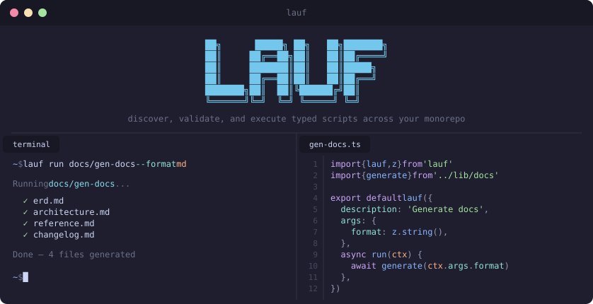

<p align="center">
  <b>Typed script runner for monorepos</b><br/>
  Discover, validate, and execute TypeScript scripts with Zod-powered arguments.
</p>

<p align="center">
  <a href="https://www.npmjs.com/package/laufen"></a>
  <a href="https://github.com/zrosenbauer/lauf/blob/main/LICENSE"></a>
  <!-- TODO: replace with valid downloads badge once npm stats are available -->
  <!-- <a href="https://www.npmjs.com/package/laufen"></a> -->
</p>

---

## Features

- 🔍 **Auto-discovery** — Scans every workspace package for scripts matching your configured glob patterns.
- ✅ **Zod-powered validation** — Define args with Zod schemas and get runtime validation + full TypeScript inference.
- 🧩 **Workspace-agnostic** — Auto-detects pnpm, npm, yarn, bun, lerna, and single-package projects.
- 💬 **Auto-prompting** — Missing required args are interactively prompted, so scripts work both in CI and locally.
- 🪶 **Tiny API surface** — One function (`lauf()`), one schema library (`z`), one convention (`scripts/` directory).

---

## Quick Start

Install the `laufen` package.

```bash
pnpm add -D laufen
```

Setup a `lauf` script, including defining args and passing in env variables.

```ts
import { lauf, z, infisical } from 'laufen';

export default lauf({
  description: 'Say hello',
  env: infisical({ path: '/ops/ci', env: 'dev' )),
  args: {
    name: z.string().default('world'),
    loud: z.boolean().default(false),
  },
  async run(ctx) {
    const greeting = `Hello, ${ctx.args.name}!`;
    ctx.logger.info(ctx.args.loud ? greeting.toUpperCase() : greeting);
  },
});
```

Run the script using the args you defined.

```bash
lauf run @my-org/my-package/hello --name=Zac --loud=true
```

> [!TIP]
> Requires Node.js >= 22.0.0

## Quick Reference

```bash
lauf init        # scaffold lauf.config.ts
lauf create      # generate a new script from a template
lauf list        # discover all scripts across the workspace
lauf run         # execute a script by name
lauf info        # view a script's args and description
```

---

## 📖 Documentation

For full docs — configuration, script API, CLI reference, examples, and more — visit the **[documentation site](https://zrosenbauer.github.io/lauf/)**.

## 📝 License

[MIT](LICENSE)
