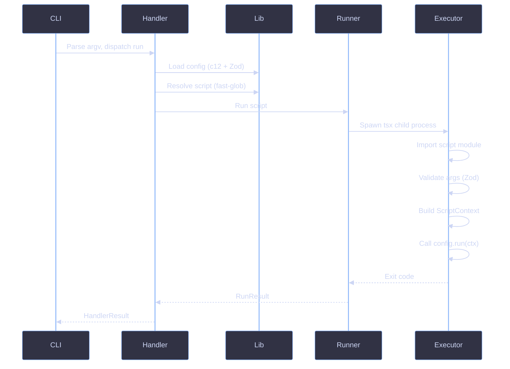

# Architecture

High-level overview of how lauf is structured, its design philosophy, and how data flows through the system.

## Overview

lauf is a typed script runner for monorepos. It discovers, validates, and executes TypeScript scripts across workspace packages with full type inference for arguments and a rich terminal UI.

The codebase follows a functional, immutable, composition-first design. There are no classes, no `let`, no `throw` statements, and no loops. Errors are returned as `Result` tuples. Side effects (process exit, terminal output) are pushed to the outermost edges.

## Layers

```mermaid
%%{init: {
  'theme': 'base',
  'themeVariables': {
    'primaryColor': '#313244',
    'primaryTextColor': '#cdd6f4',
    'primaryBorderColor': '#6c7086',
    'lineColor': '#89b4fa',
    'secondaryColor': '#45475a',
    'tertiaryColor': '#1e1e2e',
    'background': '#1e1e2e',
    'mainBkg': '#313244',
    'clusterBkg': '#1e1e2e',
    'clusterBorder': '#45475a'
  },
  'flowchart': { 'curve': 'basis', 'padding': 15 }
}}%%
flowchart TB
    subgraph cli ["CLI Layer"]
        INDEX(["src/index.ts"])
    end

    subgraph handlers ["Handler Layer"]
        INIT(["init"])
        LIST(["list"])
        INFO(["info"])
        RUN(["run"])
        CREATE(["create"])
    end

    subgraph lib ["Lib Layer"]
        CONFIG(["config"])
        DISCOVERY(["discovery"])
        RESULT(["result"])
        HANDLER(["handler"])
    end

    subgraph runtime ["Runtime Layer"]
        RUNNER(["runner"])
        EXECUTOR(["executor"])
        CONTEXT(["context"])
    end

    INDEX --> INIT & LIST & INFO & RUN & CREATE
    INIT & LIST & INFO & RUN & CREATE --> CONFIG & DISCOVERY & RESULT
    RUN --> RUNNER
    RUNNER --> EXECUTOR
    EXECUTOR --> CONTEXT

    classDef core fill:#313244,stroke:#89b4fa,stroke-width:2px,color:#cdd6f4
    classDef gateway fill:#313244,stroke:#fab387,stroke-width:2px,color:#cdd6f4
    classDef agent fill:#313244,stroke:#a6e3a1,stroke-width:2px,color:#cdd6f4
    classDef external fill:#313244,stroke:#f5c2e7,stroke-width:2px,color:#cdd6f4

    class INDEX external
    class INIT,LIST,INFO,RUN,CREATE gateway
    class CONFIG,DISCOVERY,RESULT,HANDLER core
    class RUNNER,EXECUTOR,CONTEXT agent

    style cli fill:#181825,stroke:#f5c2e7,stroke-width:2px
    style handlers fill:#181825,stroke:#fab387,stroke-width:2px
    style lib fill:#181825,stroke:#89b4fa,stroke-width:2px
    style runtime fill:#181825,stroke:#a6e3a1,stroke-width:2px
```

### CLI Layer

**File:** `src/index.ts`

The entry point. Creates a Clerc instance, registers all commands with their parameters and flags, and attaches the global error handler. Uses the `helpPlugin` and `versionPlugin` for `--help` and `--version` output. This is the only place that reads `package.json` for the CLI version.

### Handler Layer

**Files:** `src/handlers/init.ts`, `src/handlers/list.ts`, `src/handlers/info.ts`, `src/handlers/run.ts`, `src/handlers/create.ts`

Each command has a dedicated handler file. Handlers are wrapped with `defineHandler()` from `src/lib/handler.ts`, which provides two capabilities:

- **Plain function form** -- accepts the Clerc context directly, returns `HandlerResult`
- **Config object form** -- pairs a Zod schema (`parameters`) with a `handler` function; the Clerc context is validated against the schema before the handler runs

Handlers never call `process.exit` directly. They return `ok()` or `fail({ message, hint?, exitCode? })` tuples. The `handleResult()` function inside `defineHandler` centralizes exit logic.

### Lib Layer

**Files:** `src/lib/config.ts`, `src/lib/discovery.ts`, `src/lib/result.ts`, `src/lib/handler.ts`, `src/lib/paths.ts`, `src/lib/workspace.ts`, `src/lib/config-discovery.ts`

Pure(ish) utilities shared across handlers:

| Module                | Purpose                                                              |
| --------------------- | -------------------------------------------------------------------- |
| `config.ts`           | Loads `lauf.config.ts` via c12, validates with Zod, applies defaults |
| `config-discovery.ts` | Finds config files by walking upward from cwd                        |
| `discovery.ts`        | Globs workspace packages for script files via fast-glob              |
| `result.ts`           | `Result<T, E>`, `HandlerResult<T>`, `ok()`, `fail()` constructors    |
| `handler.ts`          | `defineHandler()` factory, `handleResult()` exit logic               |
| `paths.ts`            | Resolves workspace root, tsx binary, lauf package root               |
| `workspace.ts`        | Detects monorepo root via `pnpm-workspace.yaml`                      |

### Runtime Layer

**Files:** `src/runtime/runner.ts`, `src/runtime/executor.ts`, `src/runtime/context/index.ts`

The runtime executes scripts in an isolated child process:

1. **Runner** (`runner.ts`) -- Resolves the tsx binary and executor entry point, then spawns a child process with environment variables carrying the script path, arguments, workspace root, and config directory. Forwards SIGINT/SIGTERM to the child.
2. **Executor** (`executor.ts`) -- The child process entry point. Parses environment variables, dynamically imports the target script, validates arguments against the script's Zod schema, loads the lauf config, builds a `ScriptContext`, and calls `config.run(ctx)`.
3. **Context** (`context/index.ts`) -- Assembles the `ScriptContext` from resolved config values: parsed args, logger (custom or default via `@clack/prompts`), spinner, and interactive prompts.

## Data Flow

A `lauf run <script>` invocation flows through the system as follows:

## References

- [Engine API](../references/engine.md)
- [CLI](./cli.md)
- [Coding Style](../standards/typescript/coding-style.md)
- [Design Patterns](../standards/typescript/design-patterns.md)
- [Errors](../standards/typescript/errors.md)
